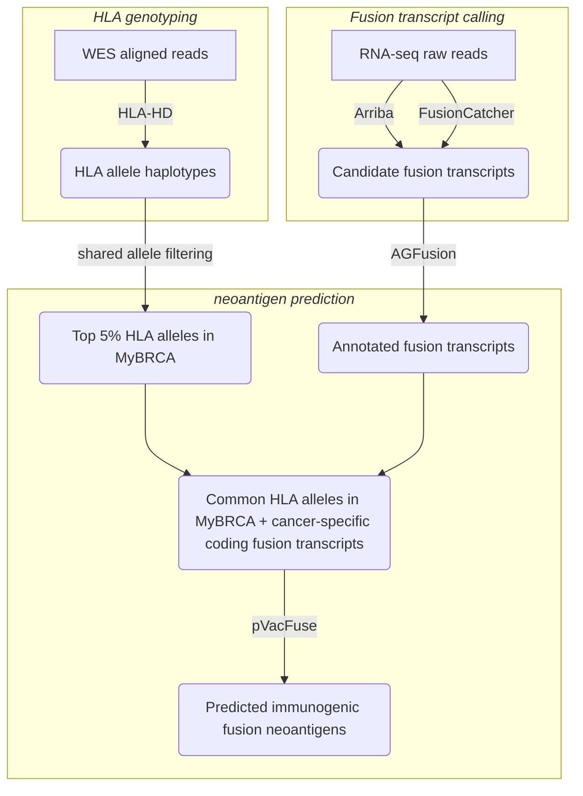

# Fusion Transcript Neoantigen Identification Pipeline (CRM)

## Background

Cancer vaccines are an emerging therapeutic option for cancer with clear potential for converting
immune “cold” tumours to “hot” tumours in combination with immune checkpoint inhibitor immunotherapy. They are also
of particular interest for the potential for the discovery and deployment of
universal cancer vaccines that can be used “off-the-shelf", in contrast to other highly
personalized approaches such as adoptive cell therapies that are likely to be too resource-
intensive and expensive to be scaled up for general use outside first world countries.

The hunt for a universal cancer vaccine continues to be a major focus area for cancer
immunotherapy, and various biotarget candidates have been proposed, including cancer neoantigens, tumour-associated antigens, tumour-associated viral
antigens, and more recently, “dark” transient epigenetically driven antigens. One of the main challenges towards developing universal cancer vaccines is that most
neoantigen targets appear to be highly individualized, with little overlap between different
patients. Another main challenge is that acquired resistance to individual targets develops
quickly due to tumour evolution. Thus, a multi-target, highly combinatorial
approach is likely to work best towards finding a generalized set of neoantigens for cancer vaccine development. 

## Overall Neoantigen Identification Workflow

