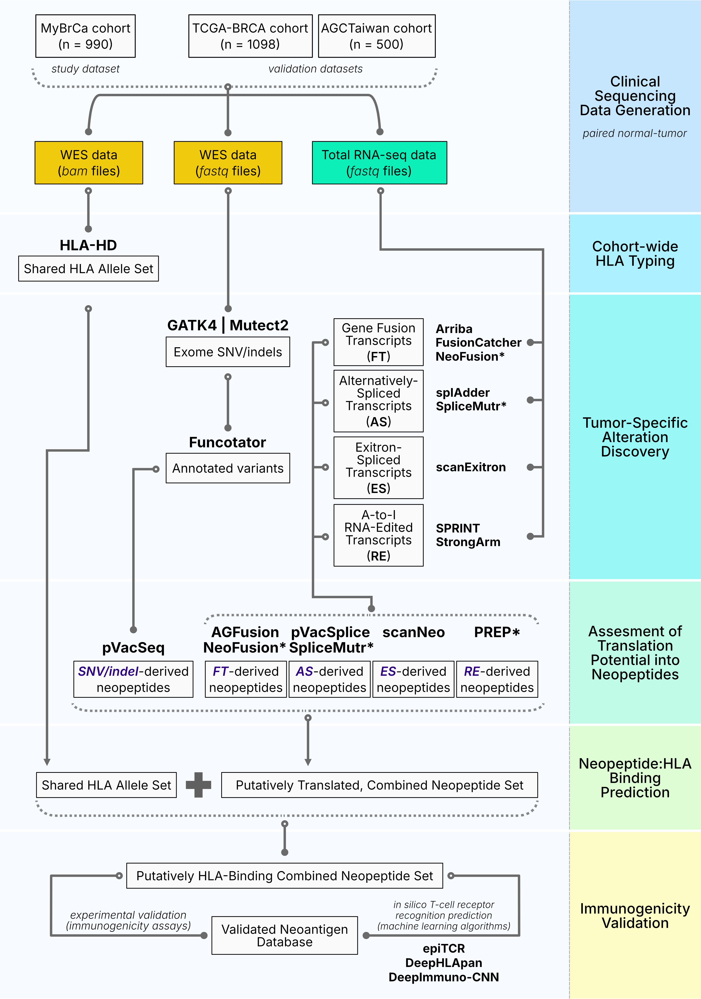

# Omni-Sourced NeoantigeN DISCOvery (NeonDisco) at CRMY


## Background

Cancer vaccines are an emerging therapeutic option for tumor diseases with a potential to convert *immune-cold* tumours to *immune-hot* tumours in combination with immune checkpoint inhibitor immunotherapy. They are also of particular interest in the quest for the generation of universal cancer vaccines that can be used  “off-the-shelf", in contrast to other highly personalized approaches such as adoptive cell therapies that are likely to be too resource-intensive and expensive to be scaled up outside first-world countries.

[Nextflow](https://www.nextflow.io/) is a free and open source software project which makes it easier to run a computational workflow consisting of a series of interconnected steps.

This repository documents the design of an integrated cancer neoantigen discovery pipeline with a focus on **alternative neoantigen search space**. This pipeline takes some inspiration from the Snakemake-based pipeline that focuses on cancer neoantigen discovery previously published in 2023 (Schäfer et al). The main Nextflow script is written in the [Nextflow DSL2](https://www.nextflow.io/docs/latest/dsl2.html) syntax. The file structure of this repository was soft-cloned from [here](https://github.com/FredHutch/workflow-template-nextflow) but the current file content and scripts have been completely customized and rewritten to fit the goal of this pipeline.

--------------------

## Overview of the Neoantigen Discovery Workflow

The flowchart belows describes the workflow underlying the Nextflow pipeline. Each step has been individually tested with local myBRCA cohort data.




## Repository Structure

The essential components of the workflow repository are as follows:
- `main.nf`: Contains the primary workflow code which pulls in all additional code from the repository
- `modules/`: Contains all of the sub-workflows which are used to organize large chunks of analysis
- `bin/`: Contains all of the scripts which are executed in each individual step of the workflow
- `docker`: Contains the Dockerfiles and the associated test scripts used to build Dockerized versions of the tool stack used in this pipeline

### User Input of Parameters

There are three ways by which users can easily provide their own inputs to a workflow; (1) with command-line flags, (2) with a config file containing the extra parameters to run the pipeline and (3) by changing default values directly in `nextflow.config`.

On the command line, parameters are provided using two dashes before the parameter name, e.g. `--param_name value`. One limitation of this approach is that the provided value will be interpreted as a string. The best example of this is the edge case of the the negative boolean (`false`), which will be interpreted by Nextflow as a string (`'false'`). The second limitation is that the command line string starts to become rather long. Another consideration of providing parameters on the command line is that they may be interpreted by the shell before execution. For example, in the context of a BASH script `--param_name *.fastq.gz` will first be expanded into a list of files which match that pattern (e.g., `--param_name 1.fastq.gz 2.fastq.gz 3.fastq.gz`), which may not be the intention. This behavior can be prevented explicitly with single-quotes in BASH, with `--param_name '*.fastq.gz'` being unaltered by the shell before execution.

By using a params file, the user is able to more explicitly define the set of parameters which will be provided. The params file can be formatted as JSON or YAML, with the example below shown in JSON.

```
{
    "param_name": "*.fastq.gz",
    "second_param": false,
    "third_param": 5
}
```

The params file is provided by the user with the `-params-file` flag. While this approach requires the user to create an additional file, it also provides a method for defining variables without worrying about the nuances of the shell interpreter. If both methods are used for providing parameters, the command line flags will take precedence over the params file ([docs](https://www.nextflow.io/docs/latest/config.html)).

The third way to pass parameters to the workflow is to set up the default values in `nextflow.config` in the `params` scope (e.g. `params{param_name = 'default_value'}`). If a user passes in a value on the command line, then the configured default `params.param_name` will be overridden. The really useful thing about `params` is that they are inherited by every sub-workflow and process that is invoked. In other words, without having to do _anything_ else, you can use `${params.param_name}` in one of the script files in `bin/`, and you know that it will contain the value that was initially set.

### Software Containers

Each individual step in a workflow should be run inside a container (using either Docker or Singularity) which has the required dependencies. For this project, I have manually custom-built Docker container images of the complete software stack needed to run the prediction pipeline. This adds modularity to the stack so users can choose to run only the necessary tools in the stack if needs be. 

Software containers should be defined as parameters in `main.nf`, which allows the value to propagate automatically to all imported sub-workflows, while also being able to be overridden easily by the user if necessary. Practically speaking, this means that every process should have a `container` declared which follows the pattern `container "${params.container__toolname}"`, and which was set in `nextflow.config` with `params{container__toolname = "quay.io/org/image:tag"}`. It is crucial that the parameter be set _before_ the subworkflows are imported, as shown in this example workflow.

------

## Running the Pipeline Minimally
A `nextflow.config` file is already created containing the default values of many parameters so this pipeline can be minimally run using this command:

> nextflow run main.nf 

### Resuming and Caching
Nextflow can resume interrupted processes so specify `-resume` flag to restart runs.

> nextflow run -resume main.nf

### Stub Commands (dry run)
I have also coded `stub` processes that would generate dummy outputs. Useful to test the pipeline without generating real output files that can be massive in sizes. Specify `-stub` at runtime to invoke this. Note that `-stub` runs separately from normal runs, so if you specify `-stub -resume` it resumes whatever interrupted previous stub runs (or validate previous stub run cached outputs). This combination does not put stub output files in previously run work directory with real output files. 

### Using Profiles
This pipeline can take `-profile` flag that can specify the name of the profiles (defined in `nextflow.config`) to run it using parameter configurations unique to each profile. For local testing, use `local`, and for AWS Batch submission, use `awsbatch`. 
